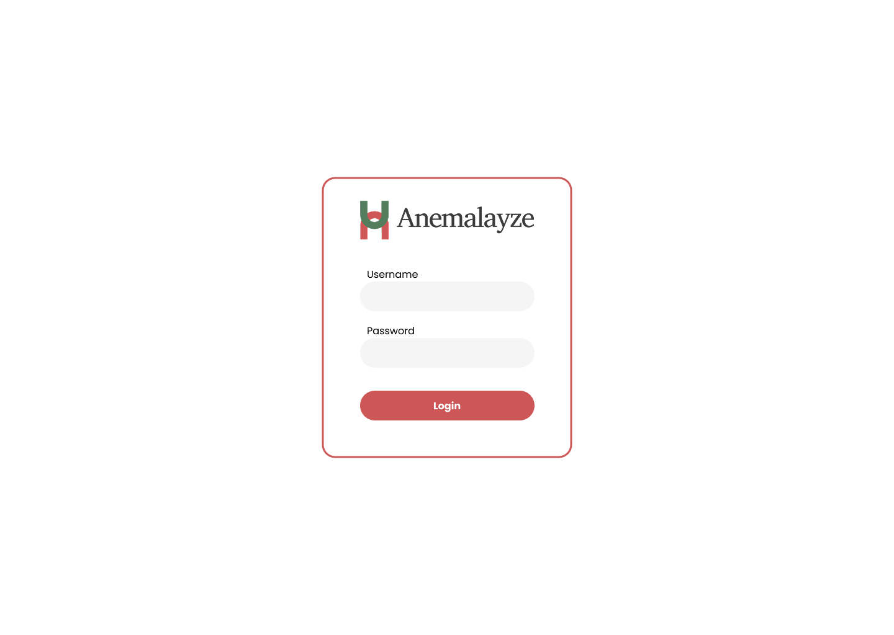
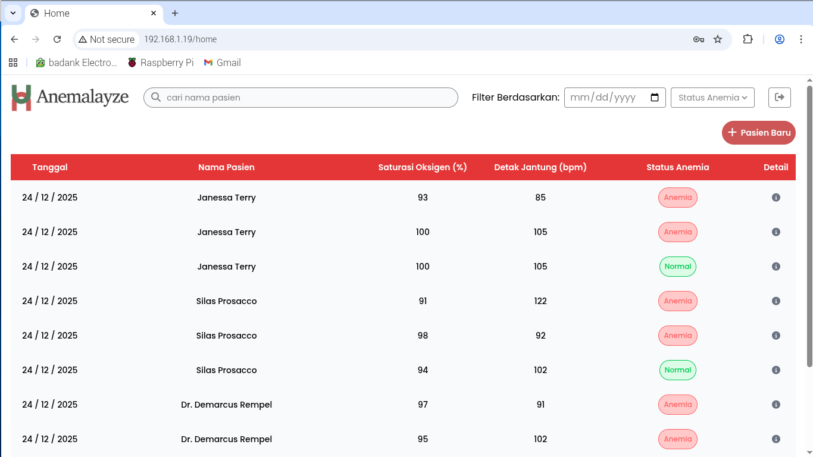
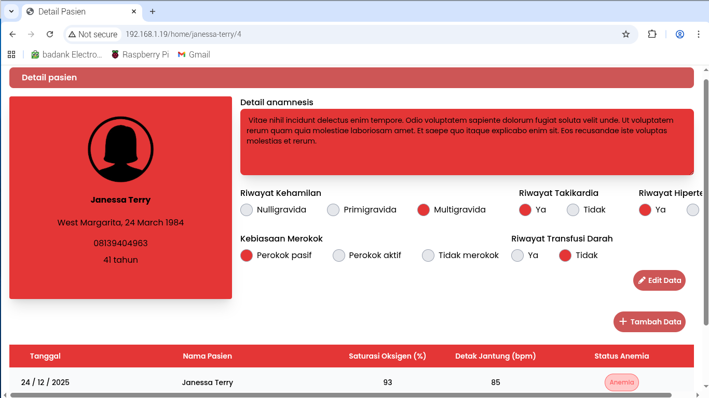
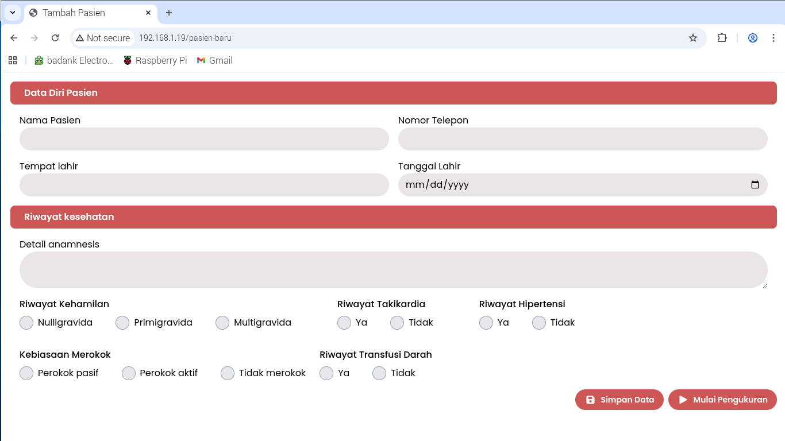
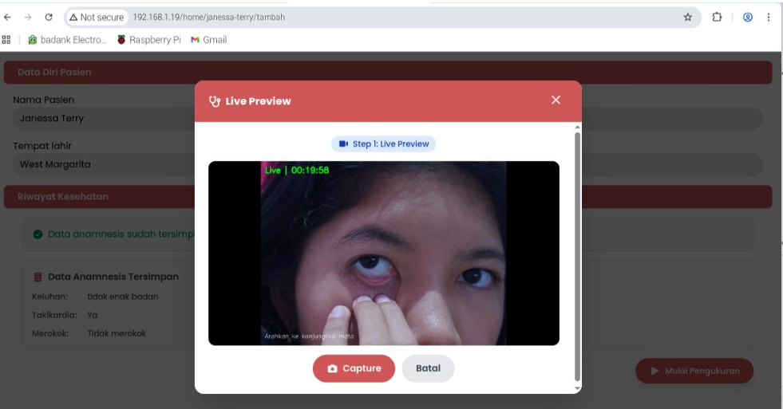

# Anemalyze

**Non-Invasive Early Anemia Detection System Using Convolutional Neural Network**

A full-stack healthcare web application integrated with Raspberry Pi hardware for real-time, non-invasive anemia screening through conjunctiva pallor analysis.

> Final Project — Computer Engineering, Universitas Andalas

---

## Overview

Anemalyze is a clinical-grade anemia detection system designed for healthcare facilities. Medical staff can register patients, capture conjunctiva images via a live camera feed, and receive instant AI-powered anemia predictions, all from a browser-based interface running on a Raspberry Pi 5.

The system combines two deep learning models with IoT sensor data to provide a comprehensive, non-invasive screening result within under 2 seconds.

---

## Features

-  **Authentication** — Secure login for medical staff
-  **Patient Management** — Register new patients with full medical history and anamnesis
-  **Search & Filter** — Search by patient name, filter by date or anemia status
-  **Patient Detail Page** — View patient profile, anamnesis, and full measurement history
-  **Edit & Update** — Update patient anamnesis and add new measurement sessions
-  **Live Camera Preview** — Real-time conjunctiva image capture via Raspberry Pi Camera V3
-  **AI Inference** — Two-stage deep learning pipeline for anemia detection
-  **Sensor Integration** — SpO₂ and heart rate reading via MAX30100 sensor
-  **Results Display** — Status anemia, confidence score, BPM, and SpO₂ shown in modal

---

##  System Architecture

The system is divided into five layers communicating via HTTP:

```
USER (Browser)
    │
    ▼
LARAVEL (Web Frontend + Controller)
    │  POST /api/camera/start
    │  POST /api/capture
    │  POST /api/analyze
    ▼
FLASK API (api.py — AI Model Server)
    │
    ├──▶ HARDWARE (Raspberry Pi Camera V3 + MAX30100 Sensor)
    │
    └──▶ AI MODEL
          ├── Stage 1: LinkNet + MobileNetV2 (Conjunctiva Segmentation)
          └── Stage 2: MobileNetV2 (Anemia Classification)
```

**Full measurement flow:**
1. User clicks "Mulai Pengukuran" → Laravel POSTs to Flask to initialize camera
2. Live MJPEG stream displayed in browser modal
3. User clicks "Capture" → Flask captures frame, saves image, triggers AI pipeline
4. Stage 1 (LinkNet): segments conjunctiva region from captured image
5. Stage 2 (MobileNetV2): classifies as Anemia / Normal with confidence score
6. MAX30100 sensor reads SpO₂ and heart rate simultaneously
7. Results (status, confidence, BPM, SpO₂) returned to Laravel and displayed

---

## Tech Stack

| Layer | Technology |
|---|---|
| Web Frontend | Laravel (PHP), Blade, JavaScript |
| Styling | CSS, Bootstrap |
| Backend API | Python, Flask |
| AI Models | TensorFlow / Keras (LinkNet + MobileNetV2) |
| Database | MySQL |
| Hardware | Raspberry Pi 5, Raspberry Pi Camera V3, MAX30100 |
| Web Server | Nginx (reverse proxy) |
| Deployment | Local network (192.168.x.x) |

---

##  Model Performance

| Metric | Value |
|---|---|
| Overall Accuracy | **86%** |
| Segmentation Model | LinkNet + MobileNetV2 backbone |
| Classification Model | MobileNetV2 |
| Inference Time | < 2 seconds |
| Dataset | Conjunctiva pallor images (women of reproductive age) |

---

##  Screenshots

### Login Page
Secure authentication for medical staff.



### Dashboard
Main patient monitoring table with search and filter by date/anemia status.



### Patient Detail
Full patient profile with anamnesis, medical history, and measurement records.



### New Patient Form
Register a new patient with complete medical anamnesis data.



### Live Camera Preview
Real-time conjunctiva image capture via Raspberry Pi Camera V3.



---

## ⚙️ Prerequisites

- Raspberry Pi 5 (recommended) or compatible device
- Raspberry Pi Camera V3
- MAX30100 pulse oximeter sensor
- Python 3.9+
- PHP 8.1+
- Composer
- MySQL
- Nginx

---

## Installation

### 1. Clone the repository

```bash
git clone https://github.com/arraudhafazyar/anemalyze.git
cd anemalyze
```

### 2. Install PHP dependencies

```bash
composer install
```

### 3. Configure environment

```bash
cp .env.example .env
php artisan key:generate
```

Edit `.env` and set your database credentials:

```env
DB_DATABASE=anemalyze
DB_USERNAME=your_username
DB_PASSWORD=your_password

FLASK_API_URL=http://localhost:5000
```

### 4. Run database migrations

```bash
php artisan migrate --seed
```

### 5. Set up Flask API

```bash
cd flask-api
pip install -r requirements.txt
python api.py
```

### 6. Start the Laravel server

```bash
php artisan serve
```

The application will be available at `http://localhost:8000`.

> **Note:** For full hardware integration, the Flask API must run on the Raspberry Pi with Camera V3 and MAX30100 connected. Nginx is used as a reverse proxy for production deployment on the local network.

---

## Project Structure

```
anemalyze/
├── app/
│   ├── Http/Controllers/     # Laravel controllers
│   └── Models/               # Eloquent models (Patient, Measurement)
├── resources/
│   └── views/                # Blade templates
├── routes/
│   └── web.php               # Application routes
├── database/
│   └── migrations/           # Database schema
└── flask-api/                # Python Flask API + AI models
    ├── api.py                # Main Flask application
    ├── models/               # Trained model files
    └── requirements.txt
```

---

## Research Context

This system was developed as a thesis project addressing the challenge of early anemia detection in women of reproductive age in Indonesia, where access to laboratory-based hemoglobin testing is limited in primary healthcare facilities (Puskesmas). 

The non-invasive approach using conjunctiva pallor analysis provides a fast, low-cost screening alternative that can be deployed on affordable hardware.

**Demo video:** [[Link to demo video](https://youtu.be/PnVNiuwvgtQ?si=Y9o1s05vx7is3v0z)]

---

##  Author

**Arraudha Fazya Ramadhani**  
Computer Engineering — Universitas Andalas  

[](https://www.linkedin.com/in/arraudhafazyaramadhani/)
[](https://github.com/arraudhafazyar)

---

## License

This project is developed for academic purposes. Please contact me for usage inquiries.
